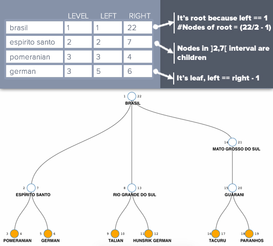

# Intervals trees in rails

Basic example of intervals trees in rails.
Live Demo there : [shielded-taiga-4796.herokuapp.com](https://shielded-taiga-4796.herokuapp.com).

## Intervals trees ?
Intervals trees are only another representation for n-ary trees.
An interval tree uses two indexes for each node: the left one and the right one. These two indexes represent an interval that will change in order to accept children.

### Examples



The advantage of interval trees is that you don't have any recursive calls when querying the tree, because the whole structure is flat! 

The downside is that inserting and removing data is very expensive, as you may need to update all the indexes of the tree in the worst case.

Here are some examples of using the tree in plain SQL:

__Count number of children of the example tree__
```sql
    SELECT
        right / 2 - 1 AS count_children
    FROM nodes
    WHERE
        left = 1
    LIMIT 1
```

__Select all the subtree of the `espirito santo` node__
```sql
    SELECT
        *
    FROM nodes
    WHERE
        left > 2
        AND right < 7
```

__Select all the leaves of the tree__
```sql
    SELECT
        *
    FROM nodes
    WHERE
        right - left == 1
```


## Application using this tree
We made an example that uses this tree. The goal of the app is just to represent
the tree you are building.

To better understand this application's implementation, you can read :

- [Gestion d'arbres par représentation intervallaire - French](http://sqlpro.developpez.com/cours/arborescence/)
- [Growing Rails](https://leanpub.com/growing-rails)


### Cutting fat models with `AsNode` and `AsRoot`
We separate the responsibility of our pretty fat model `Node` in different use-cases (kinds of "views" of our model).
This way we can handle our `Node` model view either as a root node or as
as node (a child of a root).

For example, we can select all the direct nodes of a given root like this:
```rails
Node::AsNode.where(root_id: 1, level: 2)
# note that this query will give back only Node::AsNode instances,
# no need casting !
```

If we want to select all the available root nodes, we use:
```rails
Node::AsRoot.all
```

These two models `Node::AsNode` and `Node::AsRoot` use the same table in database, but with different scope and callbacks.

In our example, we create two controllers: `Interval::RootController` and `Interval::NodeController`.
This way we can painlessly manage these two representations of our model `Node` without any type casting.

To learn more on how to use `ActiveType`, please refer to the [Active Type Gem's docs](https://github.com/makandra/active_type)


## Help Us !
Please feel free to help us by adding features to this data-structure.
The goal is to provide a model that is easy to understand and well tested, to allow for easier integration. If you feel like  helping us a bit, here is the road map :

- Validate there is no overlapping on insertion
- Add some helpers
    - Count leaves
    - Count sisters
- On building a child, choose whether we want it to be right-side or left-side
    - Create a sorted tree, to insert right/left relative to a key
- Cut/paste a subtree to another place in the tree in just 3 updates

## FAQ
### Why not a gem ?
There is no good reason to not make a gem at the moment. We just want to test it more,
and add additional functionalities before turning this a gem.
As it's always quite a big job to maintain a gem, we first try to show how this data structure can be implemented.

### Can I use this structure everywhere ?
No, this representation is only efficient when doing few inserts and lots of selects.

### How to run it
1. Clone the repository
2. Be sure to have a local Postgre database installed
3. Check database.yml for your connection details
4. Run `bundle install` to install all the required gems
5. Run `rspec` to see if our tests passes
6. Run `rails s` and enjoy the demo on your localhost

... Or go to our [live demo on heroku](https://shielded-taiga-4796.herokuapp.com/)

